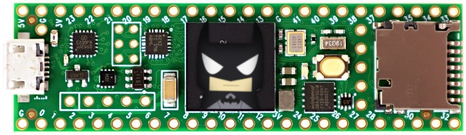

# Teensy Batmon
A Teensy-powered battery monitor.

## Files
- [`src/main.cpp`](src/main.cpp): The main program
- [`src/sfp200teensy.h`](src/sfp200teensy.h): A library for talking to the voltage monitor via CAN.
- [`src/sfp200teensy.cpp`](src/sfp200teensy.cpp): The actual code for the library.

## Terminology
- Teensy: The microcontroller that powers this thing (it's the image above).
- CAN: A form of communication, allowing two microcontrollers to communicate without a computer.
- Microcontroller: Mini computer thing?
