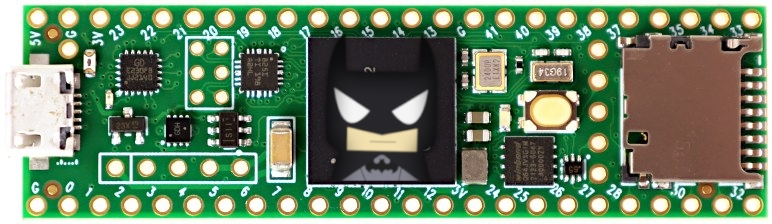

# Teensy Batmon
A ~~bat-powered~~ Teensy-powered battery monitor.

# Notes & Warnings
- **Warning**: Serial communication may be broken on macOS because it may not have the permissions necessary to run. If so, you'll have to comment out the `while(!Serial);` line in [`main.cpp`](src/main.cpp) to make it actually work. Otherwise, it'll get in an infinite loop of trying (and failing) to set up serial communication. (It should be around lines 40-50.)
- This project uses Platform I/O, not Arduino.
- This project uses the [ROSSerial library](https://github.com/frankjoshua/rosserial_arduino_lib). Platform I/O *should* install it automagically.

## Files
- [`src/main.cpp`](src/main.cpp): The main program
- [`src/sfp200teensy.h`](src/sfp200teensy.h): A library for talking to the voltage monitor via CAN.
- [`src/sfp200teensy.cpp`](src/sfp200teensy.cpp): The actual code for the library.

## Terminology
- Teensy: The microcontroller that powers this thing (it's the image above).
- CAN: A form of communication, allowing two microcontrollers to communicate without a computer.
- Microcontroller: Mini computer thing?
